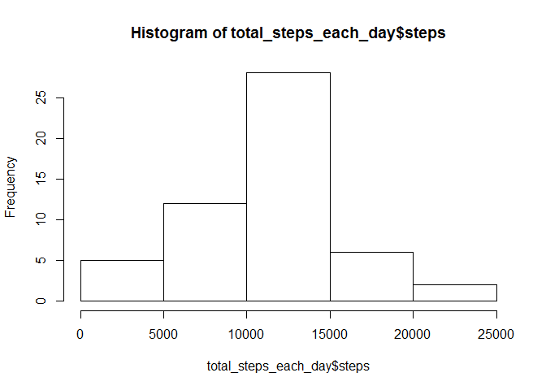
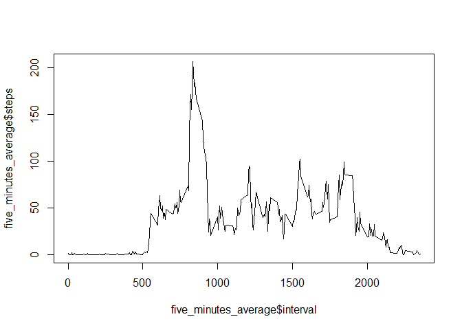
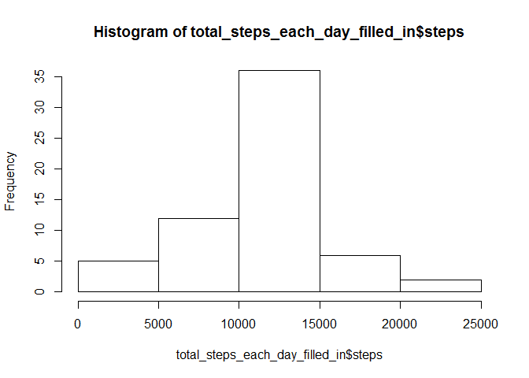

Reproducible Research: Peer Assessment
================
Neha Rai
May 6, 2017

Description of the Document
---------------------------

This is an R Markdown document. It contains the questions of the assignmemt, the R code snippet to solve and output also.

Loading and preprocessing the data
==================================

``` r
library(psych)
```

    ## Warning: package 'psych' was built under R version 3.3.3

``` r
library(lubridate)
```

    ## Warning: package 'lubridate' was built under R version 3.3.3

    ## 
    ## Attaching package: 'lubridate'

    ## The following object is masked from 'package:base':
    ## 
    ##     date

``` r
activity = read.csv("C:/Users/Neha/Desktop/coursera/reproducible_project1/activity.csv")
```

1.What is mean total number of steps taken per day
==================================================

#### a) Calculate the total number of steps taken per day

``` r
total_of_steps_per_day <- sum(activity$steps, na.rm = TRUE)
total_of_steps_per_day
```

    ## [1] 570608

#### b) Make a histogram of the total number of steps taken each day

##### Calculating the total number of steps taken each day and stored in a variable

``` r
total_steps_each_day <- aggregate(steps~date, data=activity, FUN=sum, na.rm=TRUE)
```

##### Generating the Histogram by each day

``` r
hist(total_steps_each_day$steps)
```



#### c) Calculate and report the mean and median of the total number of steps taken per day

``` r
total_steps_each_day_mean <- mean(total_steps_each_day$steps)
total_steps_each_day_median <- median(total_steps_each_day$steps)
total_steps_each_day_mean
```

    ## [1] 10766.19

``` r
total_steps_each_day_median
```

    ## [1] 10765

2.What is the average daily activity pattern?
=============================================

#### a) Make a time series plot (i.e. type = "l") of the 5-minute interval (x-axis) and the average number of steps taken, averaged across all days (y-axis)

``` r
five_minutes_average <- aggregate(steps~interval, data=activity, FUN=mean, na.rm=TRUE)
plot(x = five_minutes_average$interval, y = five_minutes_average$steps, type = "l") 
```



#### b) Which 5-minute interval, on average across all the days in the dataset, contains the maximum number of steps?

``` r
max_steps <- max(five_minutes_average$steps)
for (i in 1:288) 
{
    if (five_minutes_average$steps[i] == max_steps)
        five_minute_interval_at_max_steps <- five_minutes_average$interval[i]
}
five_minute_interval_at_max_steps 
```

    ## [1] 835

3.Imputing missing values
=========================

#### a) Calculate and report the total number of missing values in the dataset (i.e. the total number of rows with NAs)

``` r
total_na <- 0
for (i in 1:17568)
{
    if(is.na(activity$steps[i])) 
        total_na <- total_na+1 
}
total_na
```

    ## [1] 2304

#### b) Devise a strategy for filling in all of the missing values in the dataset. The strategy does not need to be sophisticated. For example, you could use the mean/median for that day, or the mean for that 5-minute interval, etc.

##### &gt;The strategy will be to fill in the dataset the with the mean of that 5 minute interval

#### c) Create a new dataset that is equal to the original dataset but with the missing data filled in.s)

``` r
activity_filled_in <- activity
for (i in 1:17568) # loop to find the na
{
    if(is.na(activity_filled_in$steps[i])) # if steps is na store the pointer 
    { 
        five_minute_pointer <- activity_filled_in$interval[i] #store the value of pointer to find the mean on five minute interval
        for (j in 1:288)  # loop to find the value of pointer on the data frame of five minute interval
        {
            if (five_minutes_average$interval[j] == five_minute_pointer) # finding the value of mean of five minute interval data frame
                activity_filled_in$steps[i] <- five_minutes_average$steps[j] # replacing the na by the mean in that fime minute interval 

        }
    }
}
```

#### d1) Make a histogram of the total number of steps taken each day and Calculate and report the mean and median total number of steps taken per day. Do these values differ from the estimates from the first part of the assignment? What is the impact of imputing missing data on the estimates of the total daily number of steps?

``` r
## Calculating the total number of steps taken each day and stored in a variable
total_steps_each_day_filled_in <- aggregate(steps~date, data=activity_filled_in, FUN=sum, na.rm=TRUE)

## Generating the Histogram by each day with new dataset (activity_filled_in)
hist(total_steps_each_day_filled_in$steps)
```



#### d2) Calculate the mean and median and explain the imoact of imputing missing data on the estimates of the total daily number of steps

``` r
## funtion mean and median
total_steps_each_day_mean_filled_in <- mean(total_steps_each_day_filled_in$steps)
total_steps_each_day_median_filled_in <- median(total_steps_each_day_filled_in$steps)
```

###### Due to that we use the mean value the new estimates of mean did not change

###### Due to that we use the mean value the new estimates of median change more close to the mean

4.Are there differences in activity patterns between weekdays and weekends?
===========================================================================

#### a) Create a new factor variable in the dataset with two levels - "weekday" and "weekend" indicating whether a given date is a weekday or weekend day.

``` r
### creating a char vector (week_day) 
week <- wday(activity_filled_in$date)
week_day <- week
for (i in 1:17568) # loop to find the na
{
    if(week[i] == 1)
        week_day[i] <- 'weekend'
    if(week[i] == 2)
        week_day[i] <- 'weekday'
    if(week[i] == 3)
        week_day[i] <- 'weekday'
    if(week[i] == 4)
        week_day[i] <- 'weekday'
    if(week[i] == 5)
        week_day[i] <- 'weekday'
    if(week[i] == 6)
        week_day[i] <- 'weekday'
    if(week[i] == 7)
        week_day[i] <- 'weekend'
}

### Creating a new factor variable in the dataset "activity_filled_in" 
activity_filled_in$weekday <-week_day
```

#### b) Make a panel plot containing a time series plot (i.e. type = "l") of the 5-minute interval (x-axis) and the average number of steps taken, averaged across all weekday days or weekend days (y-axis).

``` r
# finding the elements by "weekday" or "weekend"
weekday <- grep("weekday",activity_filled_in$weekday)
weekday_frame <- activity_filled_in[weekday,]
weekend_frame <- activity_filled_in[-weekday,]


# What  is the average daily activity pattern?

## Make a time series plot of the 5-minute interval (x-axis) and the average number of steps taken, 
##    averaged across all days (yaxis)
five_minutes_average_weekday <- aggregate(steps~interval, data=weekday_frame, FUN=mean, na.rm=TRUE)
five_minutes_average_weekend <- aggregate(steps~interval, data=weekend_frame, FUN=mean, na.rm=TRUE)

plot(x = five_minutes_average_weekday$interval, y = five_minutes_average_weekday$steps, type = "l") 
```


``` r
plot(x = five_minutes_average_weekend$interval, y = five_minutes_average_weekend$steps, type = "l") 
```


